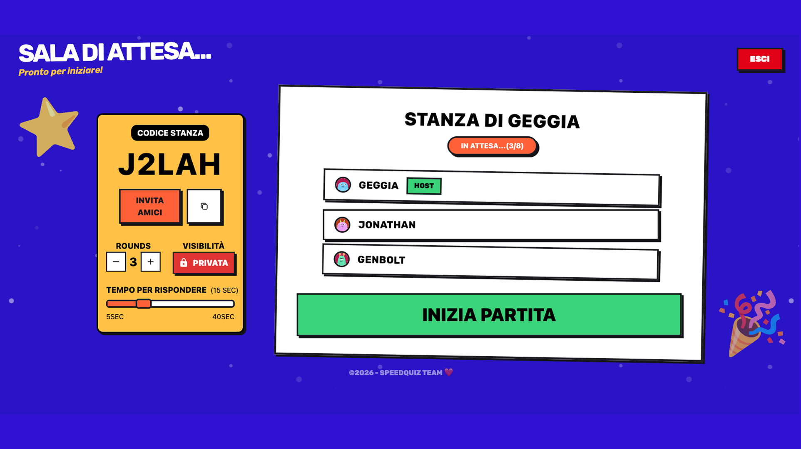
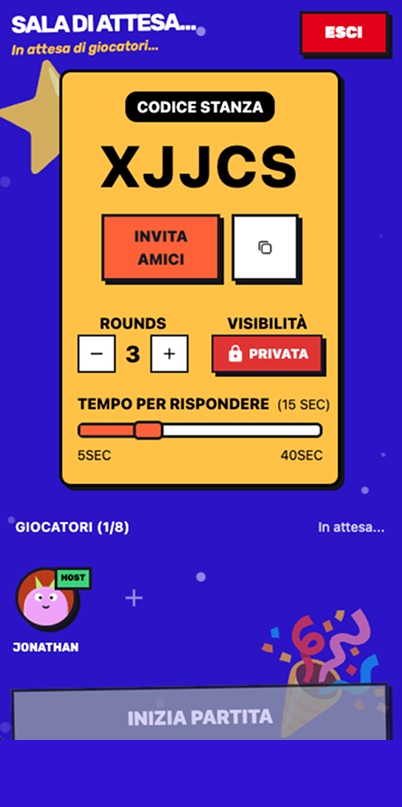
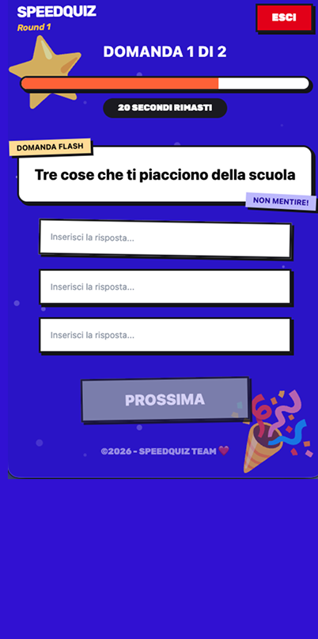
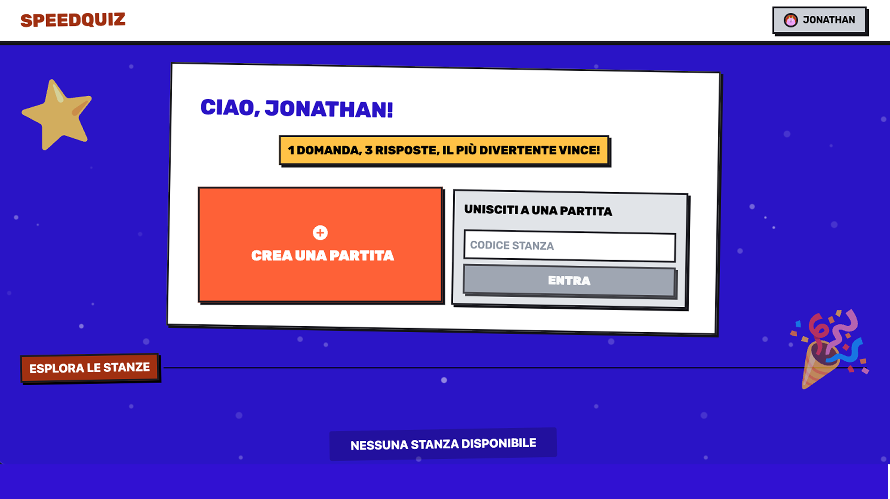

<p align="center">
  
</p>

<p align="center">
    
    
    
    
</p>

* [Cos'è SpeedQuiz](#cosè-speedquiz)
* [Chi siamo](#chi-siamo)
* [Funzionalità principali](#funzionalità-principali)
* [Architettura del Sistema](#architettura-del-sistema)
* [API REST](#API-REST)
* [Variabili d'ambiente](#variabili-dambiente)
* [Installazione](#installazione)
* [Comandi Utili](#comandi-utili)
* [Troubleshooting](#troubleshooting)
* [Licenza](#licenza)

# SpeedQuiz
> *Una domanda, 3 risposte, la più divertente vince!*

## Cos'è SpeedQuiz
<b>SpeedQuiz</b> è un party game multiplayer in tempo reale: un host crea una stanza, pubblica o privata, e gli altri giocatori entrano per unirsi alla partita con un codice.

A ogni round i giocatori vengono divisi in coppie a rotazione: ciascuno partecipa a due match contro due avversari diversi, e ogni coppia riceve una propria domanda a cui entrambi rispondono entro un tempo limite. Conclusa la fase di risposta, i giocatori non coinvolti nel match votano la risposta che ritengono più divertente tra le due. I voti ricevuti, insieme a un bonus legato all'unanimità dei voti, determinano il punteggio. Al termine dei round configurati viene mostrata una classifica finale, salvata nello storico partite di ogni utente.

Il gioco richiede un account (registrazione/login) e gestisce la sessione con access token JWT e refresh token in cookie httpOnly. Le stanze e lo stato di gioco vivono in memoria sul server e vengono orchestrati via Socket.IO; solo utenti, domande e partite concluse sono persistenti su MongoDB.

<p align="center">
  
   
</p>

## Chi siamo
Progetto sviluppato da:
* **Angelica De Feudis**
* **Jonathan Caputo**
* **Luca Gentile**


## Funzionalità principali
* **Lobby pubbliche o private**, configurabili nel numero di round, tempo di risposta e numero massimo di giocatori.
* **Riconnessione automatica**: un giocatore disconnesso resta in partita per una finestra di tempo configurabile prima di essere rimosso.
* **Statistiche di profilo e storico partite** (partite giocate, vittorie, win rate, partite recenti).
* **Documentazione API interattiva** via Swagger UI.
* **Installabilità** via Progressive Web App PWA

<p align="center">
   
    
</p>

## Architettura del Sistema

### Stack tecnologico

| Livello | Tecnologia | Ruolo |
|---|---|---|
| **Frontend** | React 19 | Libreria UI (componenti, stato, hook) |
| | Vite | Build tool e dev server |
| | React Router 8 | Routing client-side della SPA |
| | Tailwind CSS 4 | Stile e layout |
| | Socket.IO Client | Comunicazione realtime con il backend |
| | React Toastify | Notifiche a schermo |
| | React Confetti | Effetto visivo a fine partita |
| **Backend** | Node.js 22 + Express 5 | Server HTTP e API REST |
| | Socket.IO 4 | Comunicazione realtime (lobby e partita) |
| | Mongoose 9 | ODM per MongoDB |
| **Autenticazione** | jsonwebtoken | Generazione/verifica di access e refresh token |
| | bcryptjs | Hashing delle password |
| | cookie-parser | Parsing del cookie httpOnly con il refresh token |
| **Database** | MongoDB 7.0 | Persistenza di utenti, domande e partite concluse |
| **Documentazione API** | swagger-jsdoc + swagger-ui-express | Generazione e interfaccia della doc OpenAPI |
| **Infrastruttura** | Docker + Docker Compose | Containerizzazione e orchestrazione dei servizi |
| | Nginx | Reverse proxy verso il backend + hosting della SPA |

### Struttura del progetto

```
SpeedQuiz/
├── docker-compose.yml
├── LICENSE.md
│
├── backend/
│   ├── Dockerfile
│   ├── .env.example
│   ├── package.json
│   └── src/
│       ├── server.js
│       ├── swagger.js
│       ├── routes/
│       │   ├── index.js
│       │   ├── auth.routes.js
│       │   ├── lobbies.routes.js
│       │   ├── games.routes.js
│       │   └── health.routes.js
│       ├── controllers/
│       │   ├── Auth.controller.js
│       │   ├── Lobby.controller.js
│       │   ├── Game.controller.js
│       │   └── Health.controller.js
│       ├── middleware/
│       │   └── auth.middleware.js
│       ├── models/
│       │   ├── User.js
│       │   ├── Game.js
│       │   ├── Question.js
│       │   └── RefreshToken.js
│       ├── socket/
│       │   ├── index.js
│       │   └── handlers/
│       │       ├── connection.handler.js
│       │       ├── lobby.handler.js
│       │       └── game.handler.js
│       ├── services/
│       │   ├── lobby.service.js
│       │   ├── game.service.js
│       │   ├── score.service.js
│       │   └── saving.service.js
│       ├── store/
│       │   ├── lobbyStore.js
│       │   ├── questionStore.js
│       │   └── timerManager.js
│       ├── seeders/
│       │   ├── question.seeders.js
│       │   └── domande.json
│       └── utils/
│           ├── generateJWT.js
│           ├── generateRoomCode.js
│           └── generateSecret.js
│
└── frontend/
    ├── Dockerfile
    ├── .env.example
    ├── package.json
    ├── vite.config.js
    ├── index.html
    ├── assets/
    │   └── background.png
    ├── nginx/
    │   └── nginx.conf
    ├── public/
    │   ├── favicon.svg
    │   ├── manifest.webmanifest
    │   ├── logos/
    │   └── screenshots/
    └── src/
        ├── main.jsx
        ├── App.jsx
        ├── pages/
        │   ├── Home.jsx
        │   ├── Login.jsx
        │   ├── Register.jsx
        │   ├── Lobby.jsx
        │   ├── Game.jsx
        │   ├── Leaderboard.jsx
        │   └── Profile.jsx
        ├── components/
        │   ├── Header.jsx
        │   ├── ProtectedRoute.jsx
        │   ├── AuthCard.jsx
        │   ├── LobbyCard.jsx
        │   ├── GamePhase.jsx
        │   ├── Question.jsx
        │   ├── QuestionForm.jsx
        │   ├── VoteCard.jsx
        │   ├── ResultPlayer.jsx
        │   ├── PodiumPlayer.jsx
        │   ├── Gamer.jsx
        │   ├── MiniPlayer.jsx
        │   ├── StatCardProfile.jsx
        │   ├── ConfirmButton.jsx
        │   ├── EmptyState.jsx
        │   ├── MainTitle.jsx
        │   ├── SectionTitle.jsx
        │   ├── RangeSlider.jsx
        │   ├── TimeSlider.jsx
        │   ├── SettingsInput.jsx
        │   └── SingleInput.jsx
        ├── contexts/
        │   ├── AuthContext.jsx
        │   ├── UserContext.jsx
        │   └── GameContext.jsx
        ├── hooks/
        │   ├── useCountdown.js
        │   ├── useLobbySocket.js
        │   └── useGameSocket.js
        └── services/
            ├── api.js
            └── socket.js
```

## API REST

Con il backend avviato, la documentazione interattiva (OpenAPI 3.0) è disponibile su:

👉 **http://localhost:3000/api-docs**

Tutte le rotte HTTP vivono sotto il prefisso **`/api/v1`**. 
🔒 = richiede header `Authorization: Bearer <token>`.

| Metodo | Endpoint | Descrizione | Auth |
|---|---|---|:---:|
| `GET` | `/api/v1/health` | Verifica lo stato del server | |
| `POST` | `/api/v1/auth/register` | Registrazione nuovo utente (login automatico) | |
| `POST` | `/api/v1/auth/login` | Login utente | |
| `POST` | `/api/v1/auth/logout` | Logout, invalida il refresh token corrente | |
| `POST` | `/api/v1/auth/refresh` | Rinnova l'access token tramite refresh token (cookie) | |
| `PUT` | `/api/v1/auth/profile` | Aggiorna username/email/password | 🔒 |
| `GET` | `/api/v1/games` | Statistiche e storico partite dell'utente | 🔒 |
| `GET` | `/api/v1/games/:id` | Classifica finale di una partita | 🔒 |
| `POST` | `/api/v1/lobbies` | Crea una nuova lobby (o restituisce quella già attiva) | 🔒 |
| `GET` | `/api/v1/lobbies/public` | Elenco delle lobby pubbliche attive | 🔒 |

## Socket.IO
La partita vera e propria (lobby, round, risposte, voti) è gestita via **Socket.IO** 
<i>(handshake con `auth.token` = access token JWT), non tramite REST:<//i>

| Evento (client → server) | Descrizione |
|---|---|
| `lobby:join` | Entra in una lobby dato il codice |
| `lobby:leave` | Esce dalla lobby corrente |
| `lobby:modify_settings` | Modifica la configurazione della lobby (host) |
| `lobby:start` | Avvia la partita (host) |
| `game:answer` | Invia la risposta al match corrente |
| `game:vote` | Vota la risposta di un altro giocatore |

| Evento (server → client) | Descrizione |
|---|---|
| `lobby:player_joined` | Un nuovo giocatore è entrato nella lobby |
| `lobby:player_offline` | Un giocatore si è disconnesso ed è in attesa di riconnessione |
| `lobby:player_disconnected` | Un giocatore è stato rimosso dalla lobby (grace time scaduto o uscita volontaria) |
| `lobby:modified_settings` | L'host ha modificato la configurazione della lobby |
| `lobby:started` | La partita è stata avviata |
| `game:player_answered` | Un giocatore ha inviato le risposte del round corrente |
| `game:round_ended` | Il round di risposta è terminato, inizia la fase di voto |
| `game:voting_started` | È iniziata la fase di voto |
| `game:player_voted` | Un giocatore ha votato |
| `game:reveal_started` | È iniziata la fase di reveal dei risultati del round |
| `game:ended` | La partita è terminata, disponibile la classifica finale |
| `connection:error` | Errore durante la gestione della disconnessione/riconnessione |

## Variabili d'ambiente

I due servizi hanno ciascuno un proprio file, da creare a partire dal template:
```bash
cp backend/.env.example backend/.env
cp frontend/.env.example frontend/.env
```

### Backend (`backend/.env`)

| Variabile | Descrizione | Esempio |
|---|---|---|
| `PORT` | Porta di ascolto del backend | `3000` |
| `MODE` | Ambiente di esecuzione | `local` |
| `FRONTEND_URL` | Origine consentita per CORS/Socket.IO | `http://localhost:5173` |
| `MONGODB_URI` | Connection string di MongoDB | `mongodb://localhost:27017/speedquiz` |
| `JWT_SECRET` | Chiave di firma dell'access token | *(generato con `npm run secret`)* |
| `JWT_REFRESH_SECRET` | Chiave di firma del refresh token | *(generato con `npm run secret`)* |
| `DISCONNECTED_TIME` | Ms prima di rimuovere un giocatore disconnesso | `60000` |
| `DEFAULT_ANSWER_TIME` / `MIN_ANSWER_TIME` / `MAX_ANSWER_TIME` | Limiti tempo di risposta (ms) | `15000` / `5000` / `30000` |
| `VOTING_TIME` / `REVEAL_TIME` | Durata fase voto/reveal (ms) | `10000` |
| `MAX_PLAYERS` | Giocatori massimi per lobby | `8` |
| `ROUNDS_DEFAULT` | Round di default per partita | `3` |
| `BONUS` | Punti bonus velocità | `150` |
| `CODE_LENGTH` | Lunghezza del codice lobby | `5` |

> ⚠️ **Con Docker Compose**, `MONGODB_URI` e `FRONTEND_URL` vengono impostati automaticamente da `docker-compose.yml` (sezione `environment` del servizio `backend`) e **sovrascrivono** l'eventuale valore presente in `backend/.env`. Gli altri campi (JWT, timer, ecc.) vengono invece letti dal file `.env`.

Per generare i due secret JWT (da eseguire due volte, uno per `JWT_SECRET` e uno per `JWT_REFRESH_SECRET`):
```bash
cd backend && npm install && npm run secret
```
Copia i valori generati in `backend/.env`.

### Frontend (`frontend/.env`)

| Variabile | Descrizione | Esempio |
|---|---|---|
| `VITE_BACKEND_URL` | URL del backend usato dal client (HTTP e Socket.IO) | `http://localhost:3000` |
| `MODE` | Ambiente di esecuzione | `local` |
| `VITE_MIN_ANSWER_TIME` / `VITE_MAX_ANSWER_TIME` / `VITE_DEFAULT_ANSWER_TIME` | Limiti tempo di risposta lato UI. (ms) | `5000` / `40000` / `15000` |
| `VITE_ROUNDS_DEFAULT` | Round di default mostrati in UI | `3` |
| `VITE_CODE_LENGTH` | Lunghezza attesa del codice lobby | `5` |

> ⚠️ **Con Docker Compose**, `VITE_BACKEND_URL` viene definito come build-arg in `docker-compose.yml` (servizio `frontend`, `build.args`) e viene "inserito" nella build statica: il valore in `frontend/.env` **non** ha effetto sull'immagine Docker, solo sull'esecuzione con `npm run dev`/`vite build` locale.
> ⚠️ I valori MIN_ANSWER_TIME, MAX_ANSWER_TIME, DEFAULT_ANSWER_TIME, ROUNDS_DEFAULT, CODE_LENGTH devono corrispondere con la configurazione backend.

## Installazione

### Requisiti preliminari
* Docker e Docker Compose (opzione consigliata), **oppure**
* Node.js ≥ 22 e un'istanza MongoDB raggiungibile, per lo sviluppo locale senza container.

### Passaggi

1. Clona la repository:
   ```bash
   git clone https://github.com/Jonnycp/SpeedQuiz.git
   cd SpeedQuiz
   ```

2. Configura le [variabili d'ambiente](#variabili-dambiente) di backend e frontend.

3. Avvia lo stack con Docker Compose dalla root del progetto:
   ```bash
   docker compose up --build -d
   ```
   Al primo avvio del container backend il dataset di domande viene popolato automaticamente (il `Dockerfile` esegue `npm run seed` prima di `npm start`).

### Servizi disponibili dopo l'avvio

| Servizio | URL / Porta |
|---|---|
| **Frontend (via Nginx)** | http://localhost |
| **API diretta backend** | http://localhost:3000 |
| **Swagger UI** | http://localhost:3000/api-docs |
| **MongoDB** | `localhost:27017` |

## Comandi utili

Popola/ripopola manualmente il database con le domande (svuota e reinserisce la collection):
```bash
cd backend && npm run seed
```

Genera una chiave segreta casuale da usare come `JWT_SECRET` o `JWT_REFRESH_SECRET`:
```bash
cd backend && npm run secret
```

Avvia il backend in locale con auto-reload:
```bash
cd backend && npm run dev
```

Avvia il frontend in locale con hot-reload:
```bash
cd frontend && npm run dev
```

Gestione dello stack Docker:
```bash
docker compose up --build -d       # build + avvio in background
docker compose ps                  # stato dei servizi
docker compose logs -f backend     # log del backend in tempo reale
docker compose restart backend     # riavvia solo il backend
docker compose down                # ferma e rimuove i container (mantiene i dati)
docker compose down -v             # ... e rimuove anche il volume del database
```

## Troubleshooting

| Problema | Causa probabile / Soluzione |
|---|---|
| Il backend non si connette a MongoDB | Verifica `MONGODB_URI`. Con Docker Compose l'host è il nome del servizio (`mongo`/`mongodb` in `docker-compose.yml`), in locale è `localhost`. Assicurati che MongoDB sia attivo. |
| `401 Unauthorized` sulle rotte protette | Access token scaduto o mancante: il client dovrebbe chiamare `/api/v1/auth/refresh`. Se il problema persiste, `JWT_SECRET`/`JWT_REFRESH_SECRET` sono diversi da quelli usati al login: rigenerali e riesegui il login. |
| Un giocatore viene rimosso dalla lobby dopo una disconnessione | Il tempo di riconnessione è scaduto (`DISCONNECTED_TIME`). Aumenta il valore in `backend/.env` se serve una finestra più ampia. |
| Errori CORS o Socket.IO che non si connette | `FRONTEND_URL` nel `.env` del backend non corrisponde all'origine reale del frontend. Con Docker Compose viene impostato automaticamente; in locale aggiornalo a mano. |
| Il frontend non raggiunge il backend in sviluppo locale (senza Docker) | Controlla `VITE_BACKEND_URL` in `frontend/.env` e che il backend sia avviato (`npm run dev` in `backend/`). |
| `port is already allocated` | Una porta (80, 3000 o 27017) è già in uso. Liberala o cambia il mapping in `docker-compose.yml`. |
| Le modifiche al codice non si riflettono nei container | Le immagini Docker fissano il codice al momento della build: ricostruiscile con `docker compose up --build`. |
| Nessuna domanda disponibile in partita | Il seeder non è stato eseguito: `docker compose exec backend npm run seed` (o `cd backend && npm run seed` in locale). |

## Licenza
Il progetto è distribuito con una licenza proprietaria a uso accademico: nessuna parte del codice o della relazione può essere riprodotta, distribuita o riutilizzata senza il consenso scritto degli autori. Testo completo in [LICENSE.md](LICENSE.md).

© 2026 Angelica De Feudis, Jonathan Caputo, Luca Gentile. Tutti i diritti riservati.
