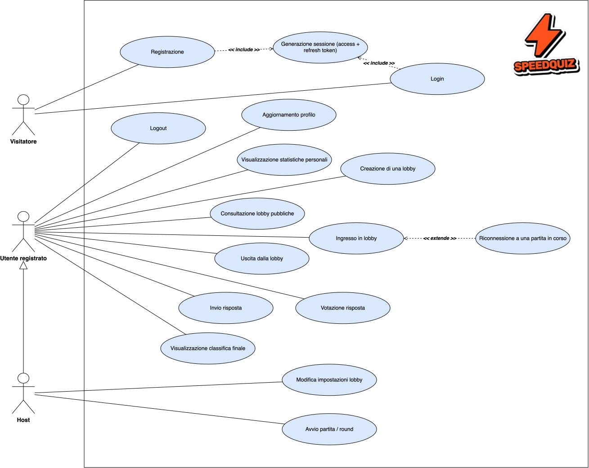
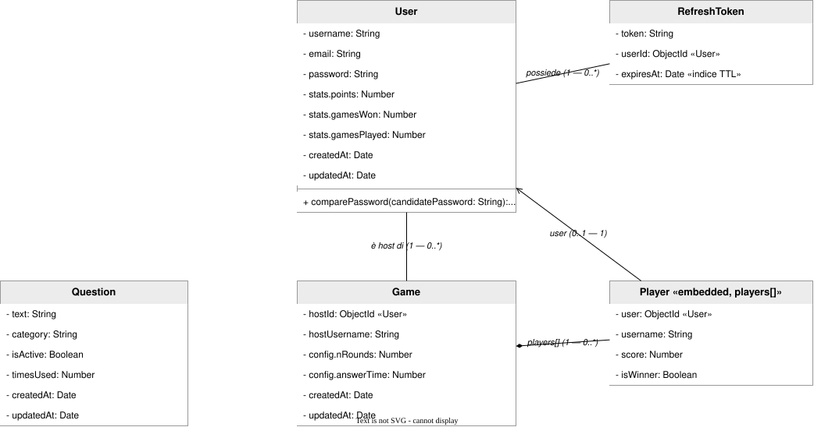
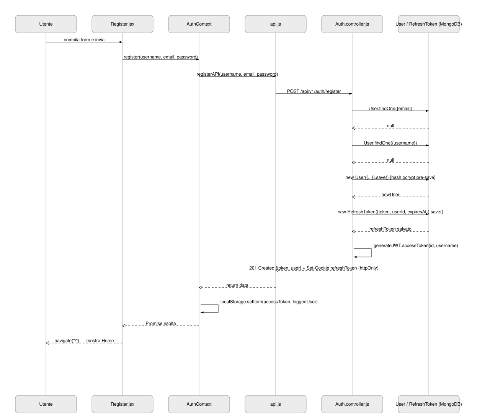
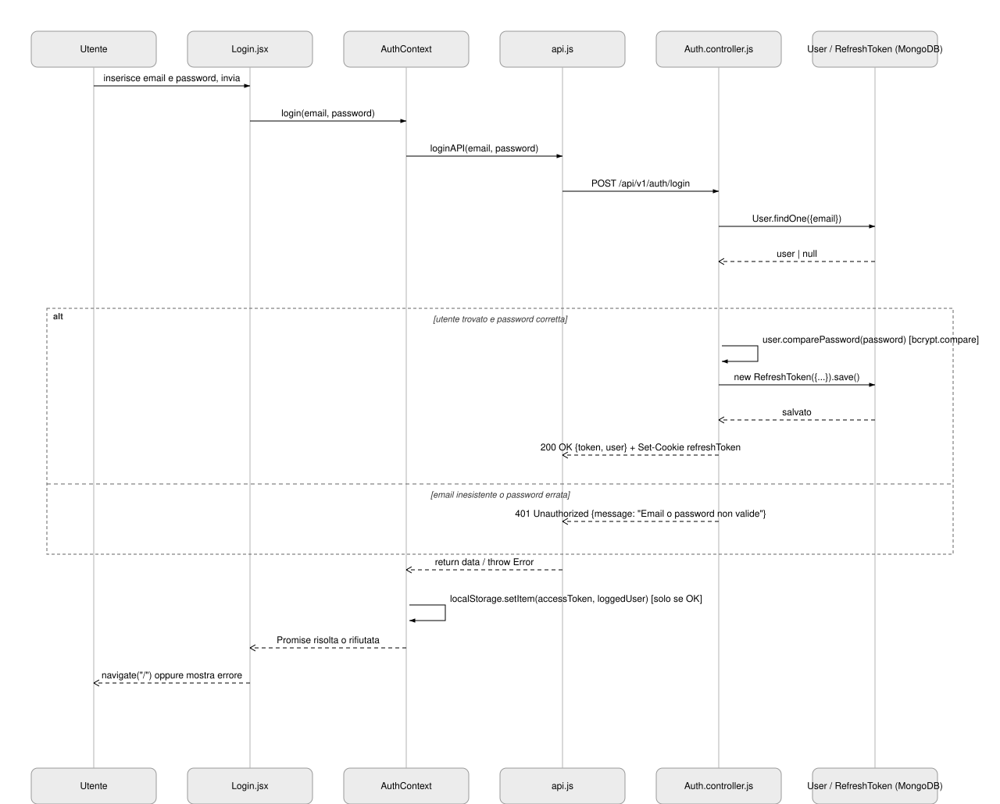
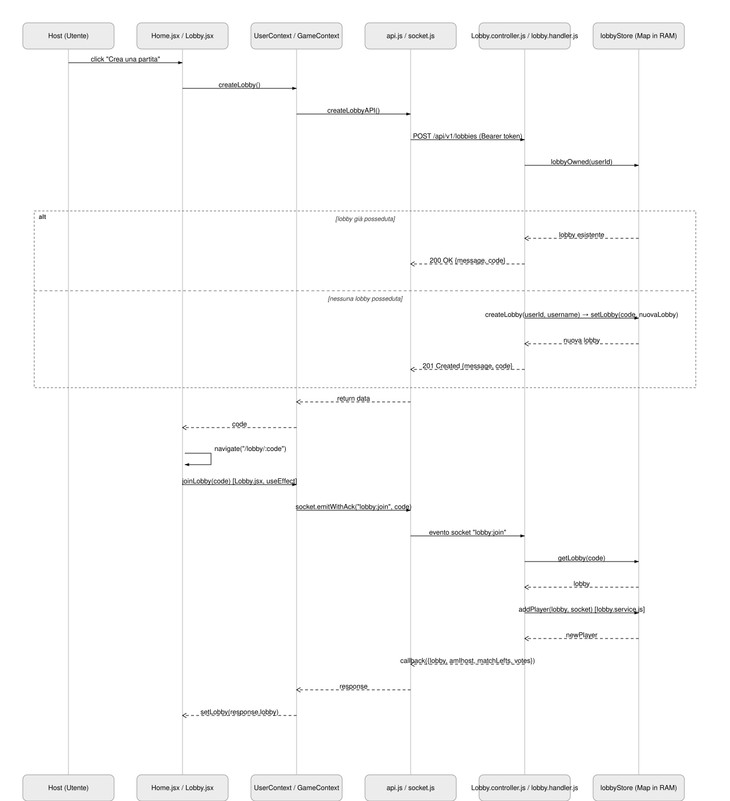
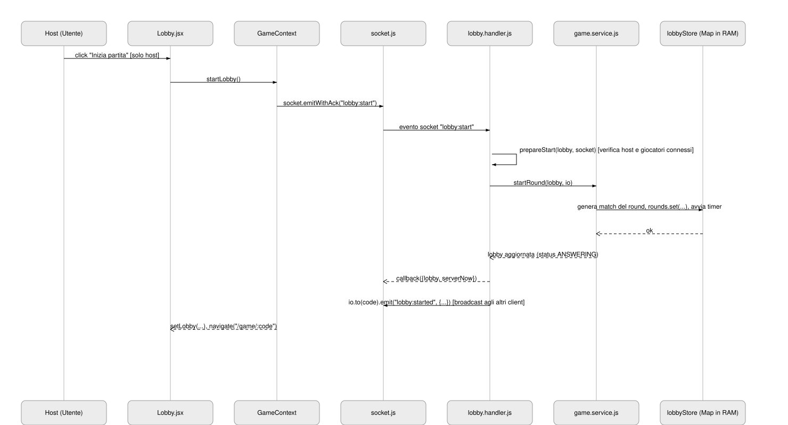

# Documentazione tecnica

## 1. Scenario applicativo

SpeedQuiz è un'applicazione web di tipo *party game multiplayer* in tempo reale. Il gioco prevede che un utente (l'host) crei una stanza, pubblica o privata, alla quale altri utenti accedono tramite un codice. A ogni round i giocatori vengono divisi in coppie a rotazione: ciascuno partecipa a due match contro due avversari diversi, e ogni coppia riceve una propria domanda a cui entrambi rispondono entro un tempo limite. Conclusa la fase di risposta, i giocatori non coinvolti nel match votano la risposta che ritengono più divertente tra le due. I voti ricevuti, insieme a un bonus legato alla velocità di risposta, determinano il punteggio. Al termine dei round configurati viene mostrata una classifica finale, salvata nello storico partite di ogni utente.

L'accesso all'applicazione richiede necessariamente un account: la sessione è gestita tramite un access token JWT restituito al client e un refresh token conservato in un cookie httpOnly. Le stanze di gioco e il relativo stato (round, risposte, voti, timer) vivono esclusivamente in memoria sul server, in una struttura dati condivisa tra tutte le richieste; solo utenti, domande e partite concluse sono memorizzate su MongoDB.

## 2. Architettura dell'applicazione

L'applicazione si basa sullo stack MERN (MongoDB, Express, React, Node.js) ed è organizzata come una *Single-Page Application* (SPA) lato client che comunica con un backend esposto sia via API REST sia via un canale Socket.IO. 
Il client è una SPA realizzata in React 19, responsabile del *rendering* dell'interfaccia, della gestione dello stato applicativo e dell'instaurazione delle comunicazioni verso il backend. 
Il server è un processo Node.js basato su Express 5, che espone una API REST sotto il prefisso `/api/v1` per le operazioni di autenticazione, gestione del profilo, creazione/ricerca di lobby e consultazione di statistiche e classifiche. Lo stesso processo ospita anche un server Socket.IO (`backend/src/socket/index.js`), montato sullo stesso oggetto `http.Server` (`backend/src/server.js`, righe 14 e 20), che gestisce in tempo reale l'intero ciclo di vita di una partita (ingresso in lobby, modifica impostazioni, avvio, invio risposte, votazioni). La persistenza è affidata a MongoDB, interrogato tramite l'ODM Mongoose, per i dati che devono sopravvivere al singolo processo server (utenti, domande, partite concluse, refresh token); lo stato volatile di una partita in corso (lobby attive, round, timer) risiede invece esclusivamente in una `Map` mantenuta in memoria dal processo Node.js (`backend/src/store/lobbyStore.js`, riga 4), e viene scritto su MongoDB solo al termine della partita (`backend/src/services/saving.service.js`).

La comunicazione client-server avviene quindi su due canali distinti e complementari:
1. **REST su HTTP**: il client invoca gli endpoint tramite `fetch` (`frontend/src/services/api.js`), allegando l'access token JWT nell'header `Authorization` quando disponibile e includendo sempre i cookie (`credentials: "include"`) per il trasporto del refresh token httpOnly. Se una richiesta protetta riceve `401`, il client tenta automaticamente un rinnovo tramite `POST /api/v1/auth/refresh` prima di ripetere la richiesta originale (`frontend/src/services/api.js`, righe 21-46).
2. **Socket.IO su WebSocket**, per l'intera logica di gioco: la connessione viene autenticata una sola volta in fase di handshake, passando l'access token nel campo `auth.token`. Da quel momento gli eventi applicativi (`lobby:join`, `lobby:start`, `game:answer`, `game:vote`, ecc.) viaggiano come messaggi Socket.IO con conferma tramite callback (`emitWithAck`), senza ulteriori scambi HTTP.

### Stack tecnologico

| Livello | Tecnologia | Descrizione |
|---|---|---|
| **Frontend** | React 19 | Libreria UI (componenti, stato, hook) |
| | Vite | Build tool e dev server |
| | React Router 8 | Routing client-side della SPA |
| | Tailwind CSS 4 | Stile e layout |
| | Socket.IO Client | Comunicazione realtime con il backend |
| | React Toastify | Notifiche a schermo |
| | React Confetti | Effetto visivo a fine partita |
| **Backend** | Node.js 22 + Express 5 | Server HTTP e API REST |
| | Socket.IO 4 | Comunicazione realtime (lobby e partita) |
| | Mongoose 9 | ODM per MongoDB |
| | jsonwebtoken | Generazione/verifica di access e refresh token |
| | bcryptjs | Hashing delle password |
| | cookie-parser | Parsing del cookie httpOnly con il refresh token |
| | swagger-jsdoc + swagger-ui-express | Generazione e interfaccia della documentazione OpenAPI |
| **Database** | MongoDB 7.0 | Persistenza di utenti, domande e partite concluse |
| **Infrastruttura** (deployment) | Docker + Docker Compose | Containerizzazione e orchestrazione dei servizi |
| | Nginx | Reverse proxy verso il backend + hosting della SPA |

## 3. Diagramma UML dei casi d'uso

L'attore **Host** è modellato come specializzazione dell'attore **Utente registrato**. Le relazioni «include» collegano **Registrazione** e **Login** al caso d'uso **Generazione sessione**, poiché entrambi i controller invocano la medesima funzione interna `gestioneRefresh`.
La relazione «extend» collega **Riconnessione a una partita in corso** a **Ingresso in lobby**, poiché la funzione `addPlayer` gestisce come ramo condizionale, e non come flusso principale, il caso in cui il giocatore risulti già presente e disconnesso.

## 4. Modello dei dati

### 4.1 Diagramma delle classi

## 5. Documentazione delle API (backend)

### 5.1 API REST
Tutte le rotte REST sono montate sotto il prefisso /api/v1 (backend/src/routes/index.js). La colonna “Autenticazione” indica se è richiesto un access token Bearer valido.

| Metodo | Endpoint | Descrizione | Auth |
|---|---|---|:---:|
| `GET` | `/api/v1/health` | Verifica lo stato del server | No |
| `POST` | `/api/v1/auth/register` | Registrazione nuovo utente (login automatico) | No |
| `POST` | `/api/v1/auth/login` | Login utente | No |
| `POST` | `/api/v1/auth/logout` | Logout, invalida il refresh token corrente | No |
| `POST` | `/api/v1/auth/refresh` | Rinnova l'access token tramite refresh token (cookie) | No |
| `PUT` | `/api/v1/auth/profile` | Aggiorna username/email/password | Sì |
| `GET` | `/api/v1/games` | Statistiche e storico partite dell'utente | Sì |
| `GET` | `/api/v1/games/:id` | Classifica finale di una partita | Sì |
| `POST` | `/api/v1/lobbies` | Crea una nuova lobby (o restituisce quella già attiva) | Sì |
| `GET` | `/api/v1/lobbies/public` | Elenco delle lobby pubbliche attive | Sì |

### 5.2 Socket.IO
La partita vera e propria (ingresso in lobby, modifica impostazioni, avvio, risposte, voti) non transita per API REST ma è gestita via **Socket.IO**.

| Evento (client → server) | Descrizione |
|---|---|
| `lobby:join` | Entra in una lobby dato il codice |
| `lobby:leave` | Esce dalla lobby corrente |
| `lobby:modify_settings` | Modifica la configurazione della lobby (host) |
| `lobby:start` | Avvia la partita (host) |
| `game:answer` | Invia la risposta al match corrente |
| `game:vote` | Vota la risposta di un altro giocatore |

| Evento (server → client) | Descrizione |
|---|---|
| `lobby:player_joined` | Un nuovo giocatore è entrato nella lobby |
| `lobby:player_offline` | Un giocatore si è disconnesso ed è in attesa di riconnessione |
| `lobby:player_disconnected` | Un giocatore è stato rimosso dalla lobby (grace time scaduto o uscita volontaria) |
| `lobby:modified_settings` | L'host ha modificato la configurazione della lobby |
| `lobby:started` | La partita è stata avviata |
| `game:player_answered` | Un giocatore ha inviato le risposte del round corrente |
| `game:round_ended` | Il round di risposta è terminato, inizia la fase di voto |
| `game:voting_started` | È iniziata la fase di voto |
| `game:player_voted` | Un giocatore ha votato |
| `game:reveal_started` | È iniziata la fase di reveal dei risultati del round |
| `game:ended` | La partita è terminata, disponibile la classifica finale |
| `connection:error` | Errore durante la gestione della disconnessione/riconnessione |

## 6. Diagrammi di sequenza
Sono stati modellati i flussi più significativi tra quelli effettivamente implementati: la registrazione (creazione dell'entità `User`), il login (autenticazione, con percorso alternativo per credenziali non valide), la creazione e l'ingresso in una lobby e l'avvio della partita da parte dell'host. 
Il flusso relativo alla lobby (creazione, ingresso, avvio) è stato suddiviso in due diagrammi distinti per mantenere ciascuno leggibile in un'unica vista.

### 6.1 Registrazione di un nuovo utente
Il flusso ha inizio quando l'utente compila il form in `Register.jsx` e lo invia; `AuthContext.register()` delega a `registerAPI()` in `api.js`, che esegue una `POST /api/v1/auth/register`. Il controller (`Auth.controller.js`, funzione `register`) verifica dapprima l'unicità di email e username tramite due interrogazioni `User.findOne`, quindi crea il nuovo documento `User` (il cui hook `pre("save")` calcola l'hash bcrypt della password, `backend/src/models/User.js`, righe 44-47) e un documento `RefreshToken` associato. La funzione `generateJWT.accessToken` produce l'access token restituito nel corpo della risposta, mentre il refresh token viene consegnato in un cookie httpOnly. Il client conclude il flusso salvando l'access token e i dati utente in `localStorage` e reindirizzando alla home.

### 6.2 Login e gestione delle credenziali non valide

Il diagramma modella il caso d'uso **Login**, evidenziando il frammento combinato `alt` che rappresenta i due esiti possibili della verifica delle credenziali nel controller (`Auth.controller.js`, funzione `login`, righe 32-74): se l'utente esiste ed `user.comparePassword` restituisce esito positivo, viene emesso un nuovo `RefreshToken` e la risposta `200 OK`. In caso contrario (email inesistente o password errata) il controller restituisce direttamente `401 Unauthorized` senza generare alcun token, come si osserva alle righe 43-52 del controller.

### 6.3 Creazione e ingresso in una lobby

Il diagramma copre la creazione della lobby da parte dell'host e l'ingresso effettivo nella stanza. La chiamata `POST /api/v1/lobbies` è gestita da `Lobby.controller.js` (funzione `create`, righe 9-22), che verifica tramite `lobbyOwned` se l'utente possiede già una lobby con stato `LOBBY`: in tal caso il frammento `alt` mostra la restituzione del codice esistente con `200 OK`; altrimenti `createLobby` (`backend/src/services/lobby.service.js`) genera una nuova lobby e la inserisce nella `Map` di `lobbyStore.js`, restituendo `201 Created`. Il client viene quindi reindirizzato alla pagina `Lobby.jsx`, che effettua l'ingresso vero e proprio tramite l'evento Socket.IO `lobby:join`, gestito da `addPlayer` (`lobby.service.js`, righe 45-91).

### 6.4 Avvio della partita

Il diagramma prosegue idealmente il precedente: l'host, unico soggetto autorizzato, avvia la partita tramite l'evento `lobby:start`. Il gestore (`backend/src/socket/handlers/lobby.handler.js`, righe 145-169) invoca `prepareStart` (`lobby.service.js`, righe 154-173), che verifica che il richiedente sia effettivamente l'host e che siano connessi almeno `minPlayers` giocatori, quindi `startRound` (`backend/src/services/game.service.js`, righe 32-67) genera i match del primo round, li inserisce nella lobby e avvia il timer di risposta. Lo stato aggiornato viene infine diffuso a tutti i client della stanza con l'evento `lobby:started`.

## 7. Descrizione dei componenti React

### 7.1 Gestione dello stato condiviso
Lo stato condiviso è organizzato in tre React `*Context*`, innestati in App.jsx (AuthProvider → UserProvider → GameProvider). 

- **`AuthContext`** mantiene l'utente autenticato e lo stato di caricamento iniziale, ripristinandoli da `localStorage` al montaggio; espone le funzioni `login`, `register`, `logout` e `updateProfile`, ciascuna delle quali invoca il corrispondente metodo di `frontend/src/services/api.js` e sincronizza `localStorage` con l'access token e i dati utente.
- **`UserContext`** espone funzioni di sola lettura verso il backend REST non legate al ciclo di vita della partita: `getUserGames`, `getLeaderboard`, `createLobby` e `getPublicLobbies`, ciascuna un sottile involucro delle rispettive funzioni di `api.js`.
- **`GameContext`** apre e chiude la connessione Socket.IO in funzione della presenza di un utente autenticato, gestisce il tentativo automatico di rinnovo del token in caso di errore di connessione, e mantiene lo stato `lobby`, `gameState` (numero di match e voti mancanti) e `offset` (scarto tra l'orologio del client e quello del server, usato dal countdown). Espone le funzioni `joinLobby`, `editSettings`, `leaveLobby`, `startLobby`, `submitAnswer` e `submitVote`, tutte implementate come chiamate Socket.IO con conferma (`emitWithAck`) verso il backend. Delega inoltre l'ascolto degli eventi in arrivo dal server ai due hook `useLobbySocket` e `useGameSocket`.

Due hook dedicati, **`useLobbySocket`** e **`useGameSocket`**, registrano i gestori per gli eventi Socket.IO in arrivo dal server (relativi al ciclo di vita della lobby e all'avanzamento della partita), aggiornando lo stato di `GameContext`.
Un terzo hook, **`useCountdown`**, calcola il tempo residuo di una fase a partire da un istante di scadenza e da un offset fra l'orologio del client e quello del server.

### 7.2 Pagine

| Componente | Finalità | Stato gestito | Chiamate API/socket |
|---|---|---|---|
| `Login.jsx` | Form di autenticazione con email e password | `email`, `password`, `error`, `isLoading` | `AuthContext.login` |
| `Register.jsx` | Form di registrazione di un nuovo account | `username`, `email`, `password`, `error`, `isLoading` | `AuthContext.register` |
| `Home.jsx` | Punto di ingresso post-login: creazione di una lobby, accesso tramite codice, elenco delle lobby pubbliche | `publicLobbies`, `lobbyCode`, `joinError`, `isDisabled` | `UserContext.createLobby`, `UserContext.getPublicLobbies`, `GameContext.joinLobby` |
| `Lobby.jsx` | Sala d'attesa di una stanza: mostra il codice, i giocatori presenti e consente all'host di configurare e avviare la partita | `settings` (round, visibilità, tempo di risposta), `isDisabled` | `GameContext.joinLobby`, `editSettings`, `startLobby` |
| `Game.jsx` | Pagina di gioco vera e propria: alterna le viste di risposta, voto e riepilogo del round in base allo stato `lobby.status` | `currentQuestion` | `GameContext.joinLobby`, `startLobby` (per il round successivo) |
| `Profile.jsx` | Visualizzazione delle statistiche personali, dello storico partite e modulo di modifica del profilo | `username`, `email`, `password`, `error`, `isDisabled`, `stats`, `tuePartite` | `UserContext.getUserGames`, `AuthContext.updateProfile` |
| `Leaderboard.jsx` | Classifica finale di una partita conclusa, con podio dei primi tre classificati | `players`, `error`, `loading` | `UserContext.getLeaderboard` |

### 7.3 Componenti React riutilizzabili

In questa sezione è fornita una descrizione sintetica dei componenti React, in gran parte privi di stato o logica propria, che ricevono dati e callback tramite props dalle pagine o dai context senza mai invocare direttamente le API o i socket.

| Componente | Funzione | Props principali |
| --- | --- | --- |
| `Header` (`components/Header.jsx`) | Barra superiore della SPA: link alla home e, a seconda della pagina corrente, pulsante di logout (in Profilo) o di accesso al profilo (altrove) | — (legge `user`/`logout` da `AuthContext`) |
| `GamePhase` (`components/GamePhase.jsx`) | Intestazione delle schermate di lobby/gioco: titolo della fase corrente e pulsante di uscita dalla lobby | `phase`, `underPhase` |
| `AuthCard` (`components/AuthCard.jsx`) | Struttura grafica comune alle pagine Login/Register: titolo, contenitore del modulo, pulsante di invio, link di commutazione fra le due pagine | `isLogin`, `children`, `onSubmit`, `isLoading` |
| `SingleInput` (`components/SingleInput.jsx`) | Campo di testo etichettato, con toggle di visibilità per i campi password | `label`, `type`, `name`, `value`, `onChange`, `minLength`, `maxLength`, `placeholder`, `required` |
| `LobbyCard` (`components/LobbyCard.jsx`) | Scheda riassuntiva di una lobby pubblica o di una partita passata (titolo, numero giocatori o data, avatar, pulsante d'azione) | `title`, `players`, `players_max`, `date`, `rotation`, `content`, `onClick`, `avatars` |
| `Gamer` (`components/Gamer.jsx`) | Riga di un giocatore nella sala d'attesa, con etichette "host" e "offline" | `username`, `id`, `isHost`, `rotation`, `offline` |
| `SettingsInput` (`components/SettingsInput.jsx`) | Controllo di impostazione della lobby: stepper numerico (round), interruttore pubblica/privata, oppure cursore (tempo di risposta), con debounce sulle variazioni | `label`, `name`, `type`, `disabled`, `minValue`, `maxValue`, `value`, `onChange` |
| `RangeSlider` (`components/RangeSlider.jsx`) | Cursore grafico personalizzato per la selezione di un valore numerico entro un intervallo, usato da `SettingsInput` per il tempo di risposta | `min`, `max`, `value`, `onChange`, `name`, `disabled` |
| `Question` (`components/Question.jsx`) | Presentazione della domanda corrente con due etichette di suggerimento | `question`, `hints` |
| `QuestionForm` (`components/QuestionForm.jsx`) | Modulo delle tre risposte a un match: salvataggio automatico differito a ogni digitazione e invio esplicito al submit | `isFinal`, `currentQuestion`, `setcurrentQuestion` (stato locale: `answers`; invoca `GameContext.submitAnswer`) |
| `TimeSlider` (`components/TimeSlider.jsx`) | Barra e/o testo del tempo residuo di una fase, sincronizzato con l'orologio del server tramite `useCountdown` e `GameContext.offset` | `totalTime`, `endsAt`, `isBar`, `isTime` |
| `VoteCard` (`components/VoteCard.jsx`) | Scheda di un partecipante al match in votazione: mostra le risposte, il pulsante di voto in fase `VOTING` e l'esito (punteggio, votanti) in fase `REVEAL` | `id`, `username`, `canVote`, `answers`, `status`, `votedBy`, `score`, `isWinner` (stato locale: `isVoted`; invoca `GameContext.submitVote`) |
| `MiniPlayer` (`components/MiniPlayer.jsx`) | Etichetta compatta con avatar e nome, con indicatore di corona per l'host; riutilizzata all'interno di `VoteCard` | `id`, `username`, `isMini` (legge `lobby` da `GameContext`) |
| `ResultPlayer` (`components/ResultPlayer.jsx`) | Riga di classifica per un giocatore non a podio (posizione, avatar, nome, punteggio) | `id`, `username`, `position`, `points`, `className` |
| `PodiumPlayer` (`components/PodiumPlayer.jsx`) | Riquadro del podio (posizioni 1-3) con evidenziazione grafica del vincitore | `position`, `username`, `points`, `id` |
| `StatCardProfile` (`components/StatCardProfile.jsx`) | Riquadro di una singola statistica numerica nel profilo utente | `value`, `label`, `bgColor`, `rotation` |
| `ConfirmButton` (`components/ConfirmButton.jsx`) | Pulsante standard dell'applicazione, con varianti di colore e stato disabilitato | `children`, `onClick`, `type`, `disabled`, `customClasses`, `color` |
| `EmptyState` (`components/EmptyState.jsx`) | Messaggio segnaposto per liste vuote (nessuna lobby pubblica, nessuna partita in storico, ecc.) | `message` |
| `MainTitle` (`components/MainTitle.jsx`) | Titolo principale centrato di una schermata | `title`, `className` |
| `SectionTitle` (`components/SectionTitle.jsx`) | Intestazione di sezione con sottolineatura decorativa | `title` |

